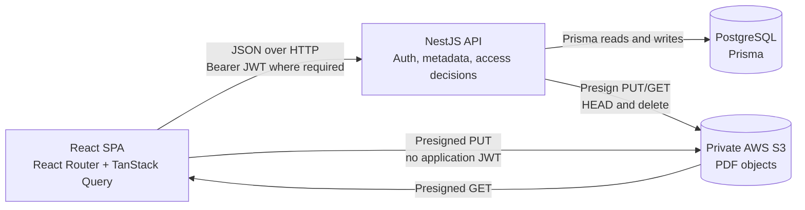

# Architecture

This document describes the current repository implementation. Proposed scaling and production-hardening options are labeled explicitly; they are not claims about features already present.

## System overview



The React single-page application owns navigation and interaction state. TanStack Query stores server state and Axios calls the API. NestJS controllers expose thin HTTP boundaries; services perform validation, ownership and share-scope checks, then use Prisma or `StorageService`.

PostgreSQL is authoritative for users, hierarchy, metadata, and sharing. S3 is authoritative for PDF bytes. The two systems are deliberately separated, but they do not share an atomic transaction.

The backend modules preserve service ownership: Prisma and storage infrastructure are exported from their modules, while feature modules import the modules whose services they inject. `FilesModule`, for example, consumes Prisma, Data Rooms, Folders, and Storage through imports rather than registering foreign services again.

## Authentication

Registration accepts an email and a password of at least eight characters. `AuthService` checks email uniqueness, hashes passwords with bcrypt at cost 12, and returns a JWT after successful registration. Login compares the submitted password to the stored hash. Password hashes are not returned by the authentication API.

JWTs contain the user's ID as `sub` and their email, are signed with `JWT_SECRET`, and expire after one hour. The frontend stores the access token in local storage, adds it as `Authorization: Bearer ...` through the application Axios client, and restores a session by calling `GET /auth/me`. A failed restoration clears the stored token.

`AuthGuard` verifies the Bearer token and attaches the verified payload to the request. Controllers pass `request.user.sub` to services; owner identity is never accepted from a request DTO. Owner-facing controllers for Data Rooms, Folders, Files, and Shares use the guard. USER share routes use the same guard plus recipient/token validation. PUBLIC share routes intentionally omit JWT authentication but require an active PUBLIC share token.

React's `ProtectedRoute` improves navigation and loading behavior, but it is not a security boundary. A caller can bypass the frontend, so the API repeats all authentication, ownership, and share-scope decisions.

There is no refresh token, session rotation, email confirmation, or password-reset flow in the current implementation.

## Data model

The Prisma schema contains five models:

- **User** stores a unique email and bcrypt password hash. It owns Data Rooms, creates Shares, and may receive USER Shares.
- **DataRoom** belongs to one owner and is the top-level boundary for folders and files.
- **Folder** belongs to one Data Room and optionally references another Folder as its parent.
- **File** belongs to one Data Room and optionally one Folder. It stores logical metadata and a unique S3 key.
- **Share** records its creator, optional recipient, token, type, role, revocation state, and optional Data Room, Folder, or File target.

Data Room and folder deletion use database cascades for dependent metadata, including Shares attached to a deleted target.

The nullable Share target columns allow the three target types in one table. The create service writes exactly one of `dataRoomId`, `folderId`, or `fileId`, and a database `CHECK` constraint enforces that invariant for every write.

## Folder hierarchy

Folders use an adjacency list:

- `parentId = null` means the folder is at the Data Room root.
- A non-null `parentId` points to the immediate parent.
- `dataRoomId` is stored on every folder so child queries and Data Room boundaries do not require walking to the root.

Creation verifies that the authenticated user owns the Data Room and, when present, that the parent belongs to the same room. There is no folder-move operation. Root contents are returned by `GET /data-rooms/:dataRoomId/contents`; `GET /folders/:id` returns a folder's immediate children, immediate files, and breadcrumbs.

Breadcrumb construction follows one parent at a time to the root, so it makes work and database round trips proportional to depth. Folder deletion and deletion statistics perform a breadth-by-level traversal: each query finds children of the current level, a visited set guards against repeat IDs, and the resulting subtree IDs scope file queries. The amount of data processed is proportional to the subtree, with approximately one folder query per level.

PostgreSQL cascades the Folder self-relation after S3 cleanup. The application does not implement materialized paths, recursive SQL CTEs, nested sets, or closure tables.

## File storage

The File model deliberately separates two concepts:

- `File.name` is the user-visible logical filename. It participates in sibling uniqueness and can change.
- `File.storageKey` is a globally unique, generated physical object identifier. It does not depend on the display name or current folder.

Keys are generated as `data-rooms/{dataRoomId}/files/{uuid}.pdf`. Renaming updates only `File.name`. Moving updates only nullable `folderId` after validating the destination remains in the same Data Room and has no filename conflict. Neither operation copies or renames an S3 object.

`StorageService` uses the AWS SDK v3. It signs PUT and GET operations for five minutes, reads object metadata with `HeadObject`, deletes one key with `DeleteObject`, and deletes multiple keys with `DeleteObjects`.

## Upload sequence

```mermaid
sequenceDiagram
    autonumber
    participant UI as React client
    participant Files as NestJS Files API
    participant DB as PostgreSQL
    participant S3 as Private S3

    UI->>Files: POST /files/upload-url<br/>name, mimeType, size, room, optional folder
    Files->>DB: Check JWT owner and destination
    Files->>Files: Generate immutable UUID storageKey
    Files->>S3: Create 5-minute presigned PUT
    Files-->>UI: uploadUrl and storageKey
    UI->>S3: PUT PDF with Content-Type application/pdf
    Note over UI,S3: Plain Axios request; no application Bearer token
    S3-->>UI: PUT result
    UI->>Files: POST /files/complete<br/>name, storageKey, room, optional folder
    Files->>DB: Recheck owner and destination
    Files->>S3: HEAD storageKey
    S3-->>Files: Actual Content-Type and Content-Length
    Files->>DB: Check storageKey and sibling-name uniqueness
    Files->>DB: Create File metadata
    Files-->>UI: File record
```

The URL request only permits `application/pdf` files up to 50 MB. Completion also requires the storage key to have the expected Data Room prefix, verifies that the object exists, checks S3's actual `Content-Type` and `Content-Length`, rejects an empty or oversized object, and rejects reuse of an already completed key. The database row is not created until those checks pass.

Important failure cases:

- A failed direct PUT leaves no File row and the UI reports an error for that item.
- A successful PUT followed by a missing or failed completion can leave an orphan object because no pending-upload record exists.
- A completion response can fail after the object exists; retry is safe with respect to `storageKey` because a completed key is unique, but an already completed retry returns a conflict rather than duplicating metadata.
- Concurrent equal display names are stopped by PostgreSQL even when both requests pass the friendly pre-check.

The frontend uploads selected PDFs independently. Each has its own progress, status, error, and Retry action; one failed file does not erase successful queue items.

## File viewing

The UI does not construct S3 URLs. It asks an endpoint appropriate to the current access mode:

- Owner: `GET /files/:id/view-url`
- USER share: `GET /shares/:token/files/:fileId/view-url`
- PUBLIC share: `GET /public/shares/:token/files/:fileId/view-url`

The owner endpoint scopes the File through the authenticated Data Room owner. Shared endpoints first resolve an active share and prove the requested File belongs to its Data Room, Folder subtree, or exact File target. Only then does the API return a five-minute presigned GET URL.

A reusable React dialog loads the returned URL in an `iframe`, handles loading and request errors, and offers an open-in-new-tab action. Its URL loader is supplied by the owner or shared caller, so presentation is reused without merging the backend security paths. A presigned URL is a temporary S3 capability; once issued, it remains usable until expiry even if access is revoked meanwhile.

## Deletion lifecycle

Deletion is S3-first so a normal storage failure does not knowingly remove the metadata needed to locate the object.

### File

1. Resolve the File through owner scope.
2. Delete its S3 key.
3. Delete its database row.

### Folder

1. Resolve the Folder through owner scope.
2. Collect all Folder IDs in its subtree.
3. Query all File storage keys in those folders.
4. Delete the S3 objects in batches.
5. Delete the root Folder and let PostgreSQL cascades remove descendant folder/file/share metadata.

### Data Room

1. Resolve the Data Room through owner scope.
2. Query all File storage keys in the room.
3. Delete the S3 objects in batches.
4. Delete the Data Room and let PostgreSQL cascades remove folder/file/share metadata.

S3 `DeleteObjects` accepts at most 1,000 keys per request, so `StorageService.deleteObjects` chunks larger key lists into groups of 1,000 and treats returned per-object errors as failure.

This ordering is not atomic. A batch may delete some objects before returning errors, or all S3 deletes may succeed before the database operation fails. In either case metadata can temporarily reference missing objects. The reverse inconsistency also exists in uploads: an object can exist without metadata. Production recovery needs explicit durable state and reconciliation rather than assuming distributed rollback.

## Sharing model

`ShareType` has two values:

- `PUBLIC` is a bearer capability represented by a UUID token. It has no recipient and can be opened without a user session.
- `USER` requires a recipient email that already resolves to another registered user. Reads require that user's JWT in addition to the token.

All current shares are created with the `VIEWER` role. The schema also defines `EDITOR` as a future extension point, but no shared write controller or service path exists. A creator may revoke only their own active share; revocation sets `revokedAt` instead of deleting the row. Created/received listings and token resolution include only active shares.

Service validation and a PostgreSQL `CHECK` constraint require each Share to target exactly one resource:

- **Data Room:** the root response lists root folders and files, and folder/file reads are allowed anywhere in that room.
- **Folder:** the root is presented as the share root. Folder path resolution must include the shared folder, so ancestors and sibling branches remain inaccessible.
- **File:** the root response exposes only that File, and only its own view URL can be issued.

For inaccessible folders and files, scope mismatch is reported as not found. This avoids distinguishing a missing ID from a real but forbidden object. Owner CRUD still requires owner scope; shared endpoints implement reads only. The frontend read-only layout is supplementary UX, never authorization.

## Database invariants

The application checks names before writes so users receive a specific conflict message. Those checks alone have a time-of-check/time-of-use race: two concurrent requests can both observe that a name is free. PostgreSQL therefore provides the final backstop, and the Data Room, Folder, and File services map Prisma `P2002` errors to HTTP `409 Conflict`.

| Resource      | Logical directory                | Database enforcement                                                     |
| ------------- | -------------------------------- | ------------------------------------------------------------------------ |
| Data Room     | All rooms belonging to one owner | Unique `(ownerId, name)`                                                 |
| Nested Folder | One parent within one Data Room  | Partial unique `(dataRoomId, parentId, name) WHERE parentId IS NOT NULL` |
| Root Folder   | Data Room root                   | Partial unique `(dataRoomId, name) WHERE parentId IS NULL`               |
| Nested File   | One folder within one Data Room  | Partial unique `(dataRoomId, folderId, name) WHERE folderId IS NOT NULL` |
| Root File     | Data Room root                   | Partial unique `(dataRoomId, name) WHERE folderId IS NULL`               |
| Share         | One target per share             | Check exactly one of `dataRoomId`, `folderId`, or `fileId` is non-null   |

The separate root indexes are essential: a regular PostgreSQL unique index permits multiple rows when a component is `NULL`. Same-named folders or files remain valid in different parents and different Data Rooms. File moves and all relevant rename/create paths use the same conflict handling. `File.storageKey` also has an independent unique constraint.

Foreign keys maintain ownership topology and apply cascades for target deletion. The database enforces Share target exclusivity, while the share creation service also validates target and PUBLIC/USER recipient rules.

## Frontend server state

TanStack Query owns fetched server state. Query keys include the authenticated user ID for owner lists/details, which prevents cache reuse across account changes. Root Data Room content and Folder detail use separate keys.

Mutations invalidate the smallest relevant scope:

- Data Room creation/deletion refreshes the current user's list; rename also updates the known detail.
- Folder changes invalidate folder detail keys and root content where necessary.
- File rename/delete refreshes the current directory.
- File move invalidates both the source and destination directory keys.
- Share create/revoke invalidates **Shared by me**.

Shared resource keys contain both access mode (`public` or `user`) and token, plus folder ID when navigating. Owner and shared caches are therefore separate, and PUBLIC and USER responses are not placed under one interchangeable key. The implementation uses invalidation/refetching rather than optimistic updates.

## Error and recovery UX

The client distinguishes authentication loading from an unauthenticated route, shows request loading/error/empty states, and uses the API's status/message where appropriate. Owner explorer failures offer retry and navigation back to the Data Room list. Shared explorer failures do not expose owner controls; they provide retry or a route appropriate to public/user access when the target was deleted or revoked.

Uploads preserve independent successes and errors and allow a failed item to be retried. Rename, move, and share forms retain the existing mutation error behavior. Delete dialogs are application-styled destructive confirmations with pending-state protection. Folder and Data Room dialogs fetch actual backend deletion statistics and present loading or fallback copy before confirmation.

Revocation uses an application alert dialog rather than a browser-native prompt. Cancel does not mutate, and pending state prevents a duplicate revoke request.

## Scaling

### Subtree computation and aggregates

The current folder subtree algorithm fetches descendants one level at a time. It is simple and bounded to the selected subtree, but a deep tree creates repeated database round trips and a wide subtree builds a large in-memory ID list. Deletion statistics then aggregate Files whose `folderId` is in that list. This is acceptable for occasional previews at the current scale.

Alternatives depend on workload:

- A PostgreSQL recursive CTE could move traversal into one database operation.
- A materialized path makes ancestor/subtree prefix queries direct but adds path-update cost if folder moves are introduced.
- A closure table optimizes arbitrary ancestry queries at the cost of extra rows and write complexity.
- Denormalized `totalSize` and `itemCount` fields make frequent reads cheap but require transactional maintenance or asynchronous updates plus reconciliation.

None of those alternatives is implemented today.

### A Data Room with 100,000 files

Indexes on `(dataRoomId, folderId)` and `(dataRoomId, parentId)` support directory-scoped reads, and the UI navigates lazily by directory rather than downloading a room-wide flat tree. However, each directory response is currently unpaginated. A single large directory can still produce an unbounded query result and DOM workload.

The first production step would be keyset pagination with a stable order and a matching composite index, for example a cursor incorporating name and ID or creation time and ID. API responses should cap page size and the UI should load pages incrementally. Deletion jobs should stream keys or process them in bounded batches rather than retaining all keys at once. If search is added later, it should use a dedicated PostgreSQL full-text/trigram index or a search service, not in-memory filtering over all files.

### Extending VIEWER to EDITOR

The role column already avoids remodeling Share records. Access resolution could return the effective role, and shared mutation services could require `EDITOR` while applying the same exact target/subtree rules used for reads. Every write would still need server-side destination checks, filename uniqueness, and ownership-independent audit context. Share creation, role assignment, revocation, and recipient management can remain owner-only. This is a design path, not current behavior.

## Security notes

- Authenticated identity comes from a verified server-side JWT payload, never a client-supplied owner ID.
- Password hashes are never included in authentication responses.
- Global DTO validation rejects unexpected body fields. UUID, email, and value validation applies to DTO properties where the corresponding class-validator decorators are declared; it does not imply that every URL parameter is UUID-validated.
- S3 objects are accessed through five-minute presigned operations rather than public object URLs.
- The direct S3 PUT uses a separate plain Axios call and does not attach the application Authorization header.
- Owner queries include ownership relationships; share queries include type, recipient when applicable, active revocation state, and target-scope checks.
- Foreign or out-of-scope resources generally return `404` rather than confirming that an ID exists.
- The request logger replaces UUID-shaped path segments with `:id`. Issued share tokens are UUIDs, so they are redacted from logged request paths.
- Client-side read-only rendering and protected routes are not trusted for enforcement.

The current design still relies on bearer tokens in browser local storage and bearer-style public share links. A stricter production threat model should review token storage, Content Security Policy, revocation latency, rate limiting, key rotation, audit logging, and bucket policy.

## Known production improvements

The following are explicit hardening opportunities, not implemented features:

1. Add upload-session or `PENDING` records, S3 lifecycle rules, and a cleanup worker for incomplete uploads.
2. Add a transactional outbox or durable deletion state plus periodic S3/PostgreSQL reconciliation.
3. Add cursor pagination and bounded background deletion for very large directories and rooms.
4. Add refresh-token rotation or another hardened session model, with revocation and device/session management.
5. Expand automated service, database integration, S3 contract, authorization-boundary, and browser end-to-end tests.
6. Add operational monitoring for failed completions, delete batches, reconciliation drift, and unusual share-token access.
